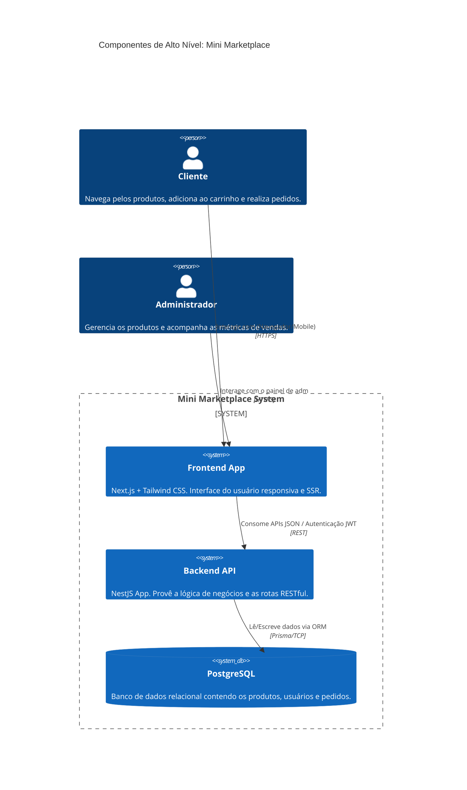
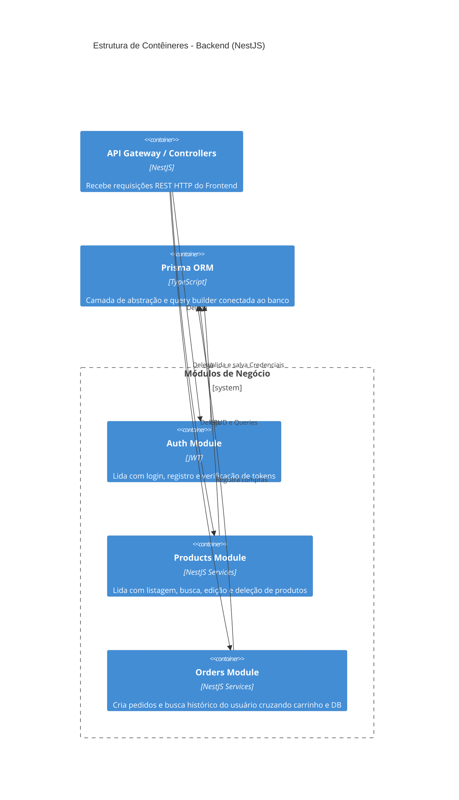
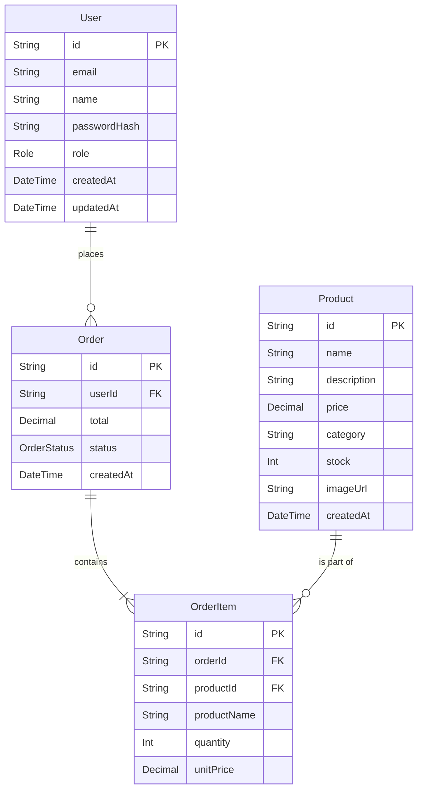
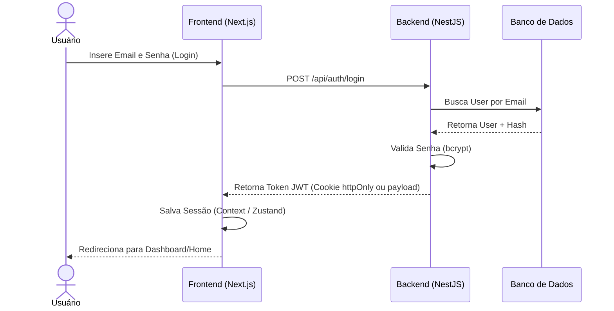

# System Design: Mini Marketplace Full-Stack

Este documento apresenta a arquitetura e componentes da aplicação através de diagramas estilo C4 e ERD, usando notação Mermaid.

## 1. High-Level Architecture (Context Diagram)

## 2. Container Diagram (Backend)

## 3. Database Entity Relationship Diagram (ERD)

## 4. Fluxo de Autenticação (Sequence Diagram)

